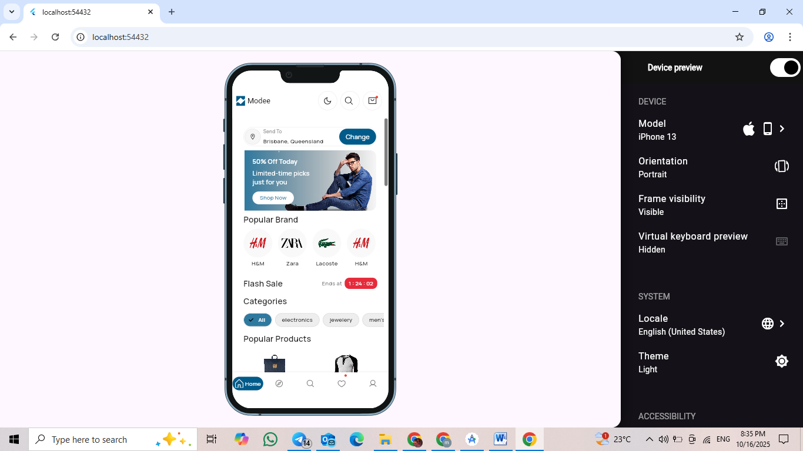
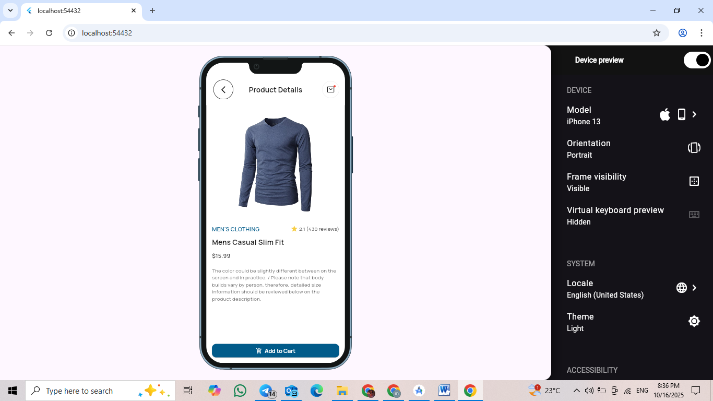
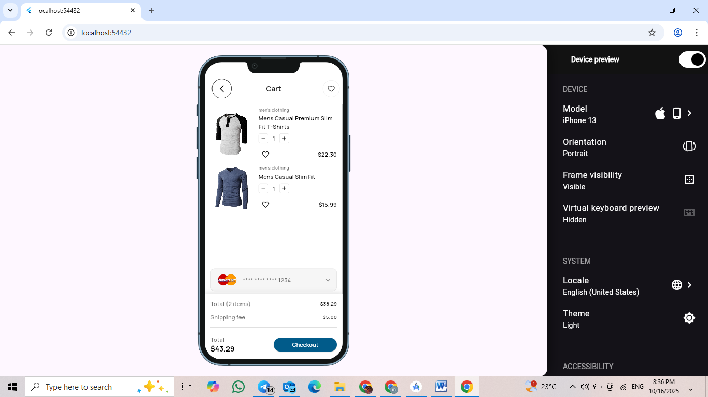
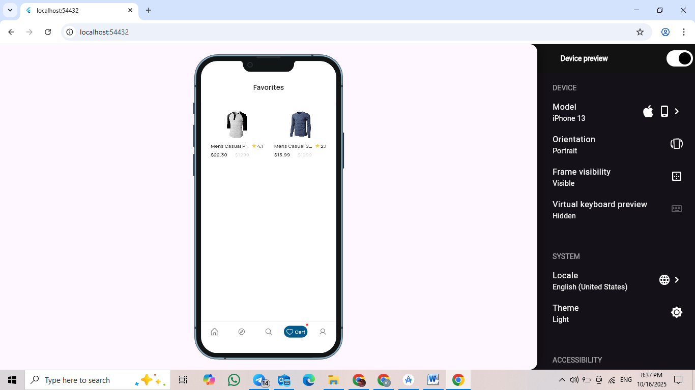
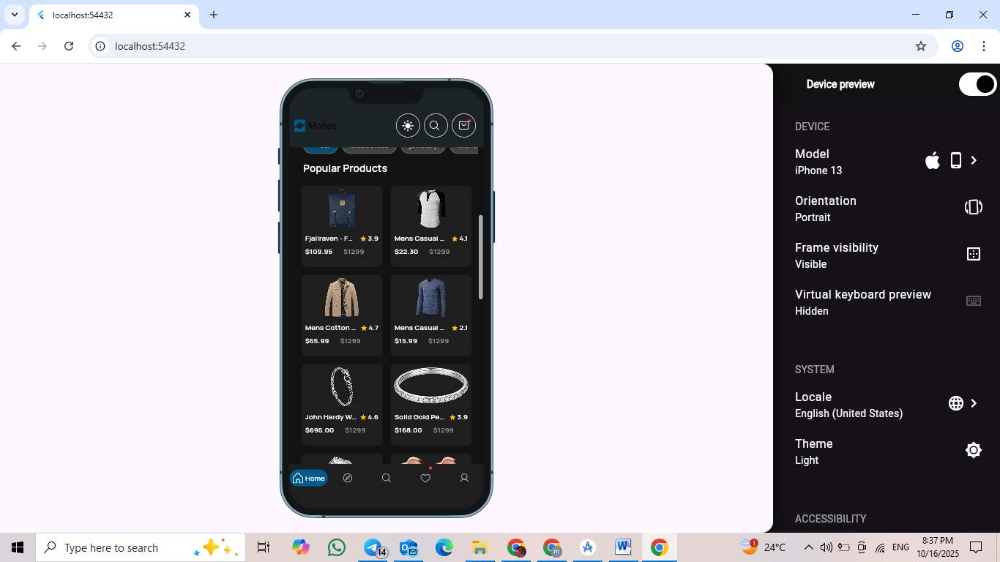

# 🛍️ E-Commerce Task

A Flutter e-commerce demo app showcasing clean architecture, dark mode, favorites, cart functionality, and category filtering — built using **Flutter**, **Bloc**, and **REST API**.

---

##  Features

✅ **Home Screen** — Displays all products dynamically with category filtering  
✅ **Product Details Page** — Shows product info, image, rating, and price  
✅ **Cart Management** — Add, remove, and update product quantities  
✅ **Favorites** — Add or remove favorite products easily  
✅ **Dark Mode** — Full dark/light theme switching  
✅ **Bloc State Management** — Clean and scalable app structure

---

##  State Management

Used **Flutter Bloc / Cubit** for predictable, reactive state handling.

**Why Bloc?**
- Separation between UI and logic
- Easy to maintain and test
- Reactive UI updates when cart/favorites change

## API Endpoints Used

| Method | Endpoint |
|--------|----------|
| GET | https://fakestoreapi.com/products |
| GET | https://fakestoreapi.com/products/categories |
| GET | https://fakestoreapi.com/products/category/{category} |
| GET | https://fakestoreapi.com/products/{id} |

## Setup Instructions

1. Clone the repository:
   git clone https://github.com/amira-ezzat/Ecommerce_Task.git
2. Navigate to the project directory:
cd Ecommerce_Task
3. Install dependencies:
flutter pub get
4. Run the app:
flutter run
## 📱 App Screenshots

| Home Screen | Product Details | Cart Page |
|--------------|----------------|-----------|
|  |  |  |

| Favorites | Dark Mode |
|------------|------------|
|  |  |
